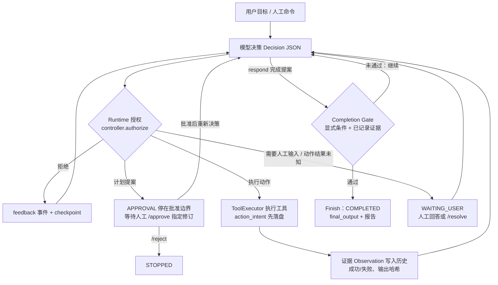

# Kong-Agent

一个面向个人本地任务的单 Agent Runtime：模型只提出决策，授权、执行、证据与验收由 Runtime 完成。

当前版本 **0.3.0**，定位为早期开发者版本。已验证环境为 Windows / Python 3.12；需要 Python 3.12+。
支持 Chat Completions 兼容模型接口，模型通过结构化 JSON 提出决策。

**发布状态：本仓库以允许清单快照的全新历史公开（内部 `docs/` 等私有材料不随仓库发布），地址 github.com/mrk-temple/Kong-Agent。以 [MIT 许可证](LICENSE) 授权。**

## 30 秒了解

| 问题 | 答案 |
|---|---|
| 是什么 | 本地单 Agent Runtime：接收目标，驱动模型决策，调用工具推进工作，保存执行证据、显式验收结果和可恢复的任务状态。 |
| 与普通聊天机器人的区别 | 聊天模型直接生成回复或动作；Kong 的模型每轮只返回一个结构化决策（`Decision` 联合类型：respond / act / plan / ask 等），由 Runtime 决定是否授权、执行并记录证据。模型不能自批计划，也不能自判完成。 |
| 模型与 Runtime 的权限边界 | 授权集中在 `runtime/controller.py`：FAST 禁止提计划，PLAN 模式在人工 `/approve` 指定修订前禁止任何环境动作，完成必须通过显式验收门。工具默认只在工作区内操作文件；本机命令、终端、浏览器需显式开关，使用当前用户权限，**不是操作系统沙箱**。 |
| 工具执行 | `ToolExecutor` 校验参数并限时执行；每次动作**先落盘** `action_intent` 再执行，结果以 `Observation`（成功/失败、输出、哈希）写入历史，失败会截断同批后续动作。 |
| 崩溃恢复 | 状态原子写入 `.kong/runs/`；恢复时**不自动重放**结果未知的动作，先停在等待人工状态，核查实际效果后用 `/resolve` 说明再继续。终端、页面、MCP 连接等外部句柄不恢复。详见 [RECOVERY](RECOVERY.md)。 |
| 确定性评测 | Kong-Eval 12 题：每题独立工作区，由 Runtime **之外**的 verifier 核验产物、保护文件哈希与状态；固定决策与机制题可完全离线复现。真实模型试次必须显式 `--live`，与工程测试、固定流程分开记录，不把小样本自测写成通用准确率。 |

## 控制闭环



每个节点对应实际代码：决策处理在 `runtime/loop.py`，授权在 `runtime/controller.py`，完成门在 `runtime/gates.py`，
状态与证据流在 `storage.py` 与 `reporting.py`；模块级说明见 [ARCHITECTURE](ARCHITECTURE.md)。
图中不存在沙箱或自动成功判定——“完成”只表示显式条件与已记录证据通过。

## 五分钟离线体验

在源码目录执行（需先安装 Python 3.12+ 和 uv）：

```powershell
uv sync
uv run kong demo --auto-approve
```

依赖安装需要网络；安装后演示不调用模型或外部服务，无需密钥。它在独立的
`.kong/demos/<id>/` 中创建文件、读取验证并通过内容验收，不覆盖项目文件。
这是固定决策演示，用于检查安装与控制流程，不能代表真实模型能力。
去掉 `--auto-approve` 可体验人工审阅计划，再输入 `/approve 1`。

## 三个可复现的离线演示

三项都不调用模型、不需要密钥，可在干净工作区独立复现（前两项与 `tests/test_cli.py`、第三项与 `tests/test_cli.py` / `tests/test_evaluation.py` 的 CI 覆盖相同机制）。

**1. 正常工具任务**——固定决策走完 提案 → 执行 → 证据 → 验收：

```powershell
uv run kong demo --auto-approve
```

预期：退出码 0；摘要行 `验收：1/1 个显式条件通过`；产物 `.kong/demos/<id>/kong-demo.txt` 存在；报告 `.kong/reports/<run_id>.json`。
失败条件：退出码非 0、验收非 1/1、产物缺失。清理：删除 `.kong/demos/` 与 `.kong/reports/` 下对应条目。

**2. PLAN 批准边界**——批准前无任何写入，批准指定修订后才执行：

```powershell
'/quit' | uv run kong demo # 停在批准边界；输出含“恢复命令：kong resume <run_id>”
'/approve 1' | uv run kong resume <run_id> # 换成上一步的 run_id
```

预期：第一步 `验收：0/1`、`产物：…（当前不存在）`、状态 `waiting_user`；第二步 `completed`、`验收：1/1`、文件内容与计划验收条件一致。
失败条件：第一步出现产物文件（批准前写入即违规）、第二步未完成或批准被模型自行放行。清理：同上。

**3. 结果未知的中断与 `/resolve`**——注入执行结果未知的动作，恢复时不自动重放：

```powershell
uv run python examples/interrupted_action_demo.py
uv run python examples/kong_eval.py --cases unknown_action_restore --repetitions 1
```

预期：脚本打印 JSON 证据并退出 0——暂停于 `waiting_user`、`pending_action_id` 存在、零观察/零模型调用/`canary.txt` 未创建，未解决前其他命令被拒绝，`/resolve` 后重新提案执行、动作 ID 不复用（`a1`,`a2`）、保护文件哈希不变、`goal_completed`。eval 用例报告 `status: success, model_calls: 0`。
失败条件：任何一项检查为 false 或退出码非 0。清理：删除脚本默认创建的 `.kong/demos/interrupted-*`。


## 连接模型

```powershell
Copy-Item kong.example.toml kong.local.toml
```

编辑对应 profile 的 `base_url`、`model`、`api_key_env`。配置文件中的模型 ID 仅是示例，
请填写服务实际支持的模型。程序会在接口根路径后追加 `/chat/completions`。
密钥通过环境变量读取，程序不会自动加载 `.env` 文件。
所需变量名见 [`.env.example`](.env.example)；该文件只是空值模板，不会自动导入。

PowerShell 7 隐藏输入密钥后启动：

```powershell
$env:KONG_API_KEY = Read-Host "模型 API Key" -MaskInput
uv run kong --profile relay run "读取 pyproject.toml，说明项目依赖"
```

本地免鉴权服务可使用 `local` profile，无需密钥；服务需预先运行并加载模型。
模型须遵守 JSON 决策协议；`json_mode = false` 仅关闭传输参数，不放松决策校验。
使用云端模型时，被选入上下文的文件内容会发送到所配置服务。

## 当前能力

| 能力 | 启用方式与范围 |
|---|---|
| 文件操作 | 默认启用；工作区内列目录、文本读取、搜索、写入与精确替换 |
| 本机命令 | `--allow-process`；有超时和输出限制 |
| 交互终端 | `--allow-terminal`；Windows ConPTY，支持多轮输入与读取 |
| 浏览器 | `--allow-browser`；独立 Chromium、DOM 操作、截图 |
| MCP | `--allow-mcp`；显式配置的 stdio / Streamable HTTP 服务 |
| 公开网页研究 | `--web live`；搜索、抓取与来源快照回读，搜索需单独配置服务 |
| 技能 | 随包提供工作区分析、代码、Word、PDF、表格、幻灯片、技能编写、研究共八个技能 |
| 连续性 | 同 Thread 对话、带来源记忆、任务摘要、暂停与恢复 |

可选组件：

```powershell
uv sync --extra test --extra skills --extra integrations
uv run python -m playwright install chromium
uv run kong --allow-process --allow-terminal --allow-browser --allow-mcp doctor
```

启用开关放在子命令前，仅作用于本次启动。`doctor` 默认检查本地环境，不调用模型或搜索服务；
`doctor --online` 才进行可能计费的联网检查。MCP 服务器与网页研究的配置方式见
[配置示例](kong.example.toml)。

## 执行与核验

```powershell
uv run kong --allow-process run "读取工作区订单，汇总为 report.csv，核对总额后报告"
uv run kong run "整理项目资料，先提交方案" --mode plan
uv run kong runs
uv run kong summary <run_id>
uv run kong --allow-process resume <run_id>
```

FAST / AUTO / PLAN 共用执行循环，模型调用上限分别为 4 / 40 / 60；PLAN 批准前不执行工具。
可以用 `--criteria` 提供文件内容、工具操作与结果等显式验收条件。工具调用成功不等于目标正确，
最终产物仍应按任务要求独立检查；`completed` 只表示 Runtime 的显式验收门通过。

模型或网络异常会保存并暂停；中断后结果未知的动作不会自动重放。恢复前需检查实际状态，
必要时用 `/resolve` 说明。恢复任务不会复活旧终端、浏览器页面或 MCP 连接；
流程与命令见 [RECOVERY](RECOVERY.md)，快照与报告字段见 [ARCHITECTURE](ARCHITECTURE.md)。

## 已知边界

- 本机命令、终端和浏览器具有当前用户的权限，**不是操作系统或网络沙箱**；文件工具的路径限制不约束任意程序。
- 文件工具主要处理 UTF-8 文本；读取/修改最多 256 KB。技能提供流程与基础检查，不保证 OCR、视觉排版或公式重算。
- 浏览器不继承个人登录态；没有浏览器视觉理解、专用 iframe 定位或上传下载管理。
- 模型层尚无流式输出或供应商原生工具调用；上下文预算使用估算值，报告用量仅来自实际返回值（缺失时显示“未知”）。
- 不提供多 Agent、网页产品界面、云同步、后台调度或长期无人值守可靠性承诺。

## 如何验证

```powershell
uv sync --extra test --extra skills --extra integrations
uv run pytest -q
uvx ruff@0.16.9 check .
uv run python examples/release_regression.py
uv run python examples/kong_eval.py --list
uv run python examples/kong_eval.py --repetitions 3
uv build
uv run python examples/verify_release_install.py dist/kong_agent-0.3.0-py3-none-any.whl
```

工程测试、固定模型流程测试和真实模型任务结果分开记录。当前完整工程测试基线为
**253 passed / 1 skipped**（唯一跳过：主机无符号链接权限）；历史 V0.3 收尾记录 226/1、
隔离基线 238/1 与阶段收尾 251/1、252/1 属旧结果，均不是任务成功率。CI 工作流见
[`.github/workflows/ci.yml`](.github/workflows/ci.yml)。评测任务、分母、判分与结果边界见
[EVALUATION](EVALUATION.md)（题目定义在 [`src/kong/evaluation/specs.py`](src/kong/evaluation/specs.py)）。

许可证确定前，发布整理脚本仅生成待审阅候选文件，不向远端上传：

```powershell
uv run python examples/prepare_public_release.py
```

发布范围、扫描证据与剩余门槛见 [PUBLIC_RELEASE_CHECKLIST](PUBLIC_RELEASE_CHECKLIST.md)；
版本变化见 [CHANGELOG](CHANGELOG.md)。

## 文档导航

| 文档 | 内容 |
|---|---|
| [ARCHITECTURE](ARCHITECTURE.md) | 模块地图、决策协议、策略与预算、授权边界、完成门与证据流 |
| [RECOVERY](RECOVERY.md) | 持久化点、未知结果动作、`/resolve`、不可恢复的外部句柄 |
| [EVALUATION](EVALUATION.md) | 12 题与 model/mechanism 分母、任务契约、判分口径、已记录基线与边界 |
| [PUBLIC_RELEASE_CHECKLIST](PUBLIC_RELEASE_CHECKLIST.md) | 公开发布门槛与已验证证据 |
| [CHANGELOG](CHANGELOG.md) | 版本变化与各阶段验证记录 |
| [kong.example.toml](kong.example.toml) / [`.env.example`](.env.example) | 配置与环境变量模板 |

内部开发文档保留在私有仓库的 `docs/`，不进入公开工程库，本页不链接它们。
